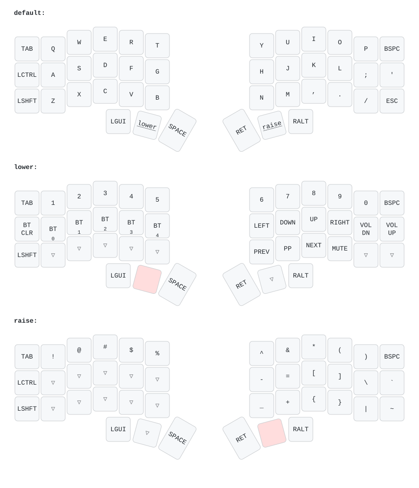

# Keymap — Corne wireless

Mapa visual de las teclas y capas configuradas en este repo. Para el código fuente ver [config/corne.keymap](config/corne.keymap).

## Vista general (las 3 capas)



Generado con [keymap-drawer](https://github.com/caksoylar/keymap-drawer). Las teclas en rojo claro de la fila del pulgar son los activadores de capa (`lower`, `raise`).

## Cómo se activan las capas

| Capa | Cómo activarla | Para qué sirve |
|---|---|---|
| `default` | Sin nada pulsado | Escribir normal (letras, espacio, enter) |
| `lower` | Mantén pulsada la tecla pulgar **izquierda** central | Números, flechas, Bluetooth, volumen, multimedia |
| `raise` | Mantén pulsada la tecla pulgar **derecha** central | Símbolos `! @ # $ % & * ( ) [ ] { } | \` |

Las capas son momentáneas: en cuanto sueltas la tecla, vuelves al default.

## Capa `lower` — referencia rápida

### Bluetooth (mitad izquierda)

| Tecla | Acción |
|---|---|
| `LWR` + `Q` (BT CLR) | **Borra** el perfil BT actual (úsalo si el Mac no quiere emparejar) |
| `LWR` + `A` (BT 0) | Cambia al perfil BT **0** |
| `LWR` + `S` (BT 1) | Cambia al perfil BT **1** |
| `LWR` + `D` (BT 2) | Cambia al perfil BT **2** |
| `LWR` + `F` (BT 3) | Cambia al perfil BT **3** |
| `LWR` + `G` (BT 4) | Cambia al perfil BT **4** |

Permite emparejar hasta 5 dispositivos distintos y cambiar entre ellos.

### Flechas y volumen (mitad derecha, fila central)

| Tecla | Acción |
|---|---|
| `LWR` + `H` | ← |
| `LWR` + `J` | ↓ |
| `LWR` + `K` | ↑ |
| `LWR` + `L` | → |
| `LWR` + `;` | **Bajar volumen** |
| `LWR` + `'` | **Subir volumen** |

### Multimedia (mitad derecha, fila inferior)

| Tecla | Acción |
|---|---|
| `LWR` + `N` | Pista anterior |
| `LWR` + `M` | Play / Pause |
| `LWR` + `,` | Pista siguiente |
| `LWR` + `.` | Mute |

## Capa `raise` — referencia rápida

Símbolos. Fila superior = shift+número, filas inferiores = símbolos de programación.

| Fila | Mitad izquierda | Mitad derecha |
|---|---|---|
| Superior | `! @ # $ %` (sobre Q W E R T) | `^ & * ( )` (sobre Y U I O P) |
| Central | (sin cambios) | `- = [ ] \` y backtick |
| Inferior | (sin cambios) | `_ + { } |` y tilde |

## OLED — qué muestra cada pantalla

| Mitad | Qué muestra |
|---|---|
| Izquierda (peripheral) | Estado BT, batería, animación bongo cat |
| Derecha (central, con USB) | Estado BT, batería, modificadores activos (símbolos macOS ⌃⇧⌥⌘), gato Luna reactivo a tu velocidad de tecleo |

Más detalle del módulo OLED en [mctechnology17/zmk-nice-oled](https://github.com/mctechnology17/zmk-nice-oled).

## Cosas que NO están en el keymap (limitaciones conocidas)

- **No hay tap-dance, ni home row mods, ni combos.** El keymap es directo, una tecla = una acción.
- **No hay capa para emojis** ni layout extra (US es lo único).
- **Caps Lock** no está mapeado — para mayúsculas continuas hay que mantener Shift, o añadirlo en alguna capa si lo necesitas.
- **F1-F12** tampoco están — si las necesitas, hay sitio libre en `raise_layer` para añadirlas.

## Cómo cambiar el keymap

1. Edita [config/corne.keymap](config/corne.keymap).
2. Commit + push.
3. GitHub Actions compila los `.uf2` en ~3 min (mira en la pestaña Actions).
4. Descarga el zip de artifacts y flashea ambas mitades.

Para regenerar la imagen del keymap tras un cambio:

```bash
pip install keymap-drawer
keymap parse -z config/corne.keymap | keymap draw - > images/keymap.svg
```

Referencia de códigos ZMK válidos para `&kp`: https://zmk.dev/docs/keymaps/list-of-keycodes
